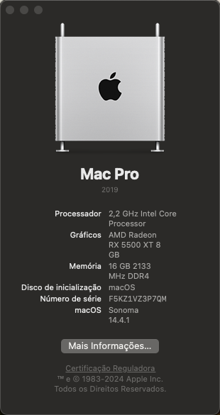
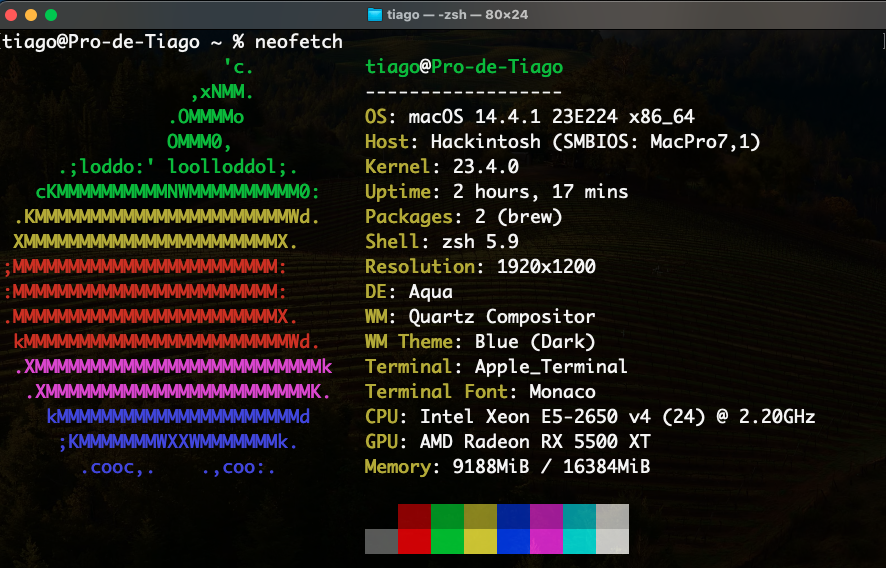

# EFI - Hackintosh - X99H - RX 5500 XT

**OpenCore 0.9.9**

## Introdution
This is the Hackintosh EFI Folder for MACHINIST X99H - XEON E5 2650 V4 - RX 5500 XT. The configuration settings support MacOS Ventura (I updated to Sonoma directly through the system itself and it worked perfectly).

*ALC897 Working perfectly.*

## Hardware Specs
* **Desktop Computer**: MACHINIST X99H PR9
* **CPU**: [Intel® Xeon® E5-2650 v4](https://www.intel.com.br/content/www/br/pt/products/sku/91767/intel-xeon-processor-e52650-v4-30m-cache-2-20-ghz/specifications.html)
* **GPU**: RX 5500 XT
* **RAM**: 16GB DDR4
* **HDD**: SSD 480 GB
* **MacOS**: Sonoma

## Working
* CPU Turbo Boost & Thermal Throttling
* ALC897 Audio
* All USB Ports
* LAN & Wireless Network
* Airdrop & Airplay
* Partly Sleep & Wakeup

## BIOS Settings
* CSM: ***Disabled*** *(UEFI MODE ON)*
* System Configuration → SATA Operation: ***AHCI***
* Secure Boot → Secure Boot Enable: ***Disabled***

## ATTENTION
**Use [MacRecovery](https://github.com/acidanthera/OpenCorePkg/tree/master/Utilities/macrecovery) to create your MacOS image**